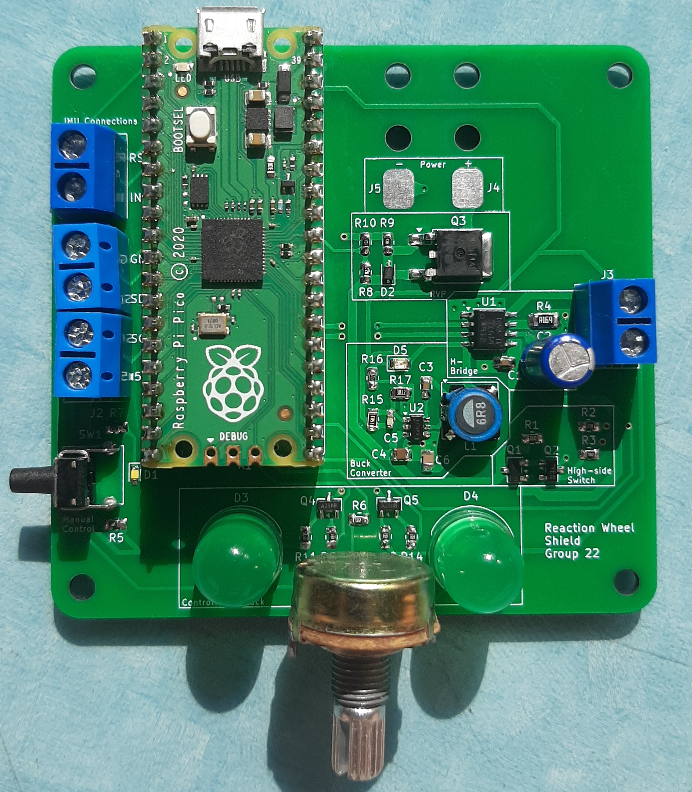

# Reaction Wheel Inverted Pendulum

## How it works
An inverted pendulum is an inherently unstable mechanical system because its centre of mass is positioned above its pivot point. As a result, small disturbances cause the pendulum to move away from its upright position unless corrected back to its original position. In this project, torque is produced by accelerating or decelerating a reaction wheel mounted to the pendulum. The resulting reaction torque acts on the pendulum body and is used to oppose its movement. 

The design uses an inertial measurement unit (IMU), to measure the pendulum’s angular position and motion. These measurements are processed by a Raspberry Pi Pico, which runs the feedback-control algorithm. The resulting control signal is supplied to an H-bridge motor driver, allowing the speed and direction of the brushed geared DC motor to be controlled. The motor drives the reaction wheel, completing the closed-loop control system. 

## How to use
You can refer to the documentation located in: [Instructions](Instructions.pdf)
